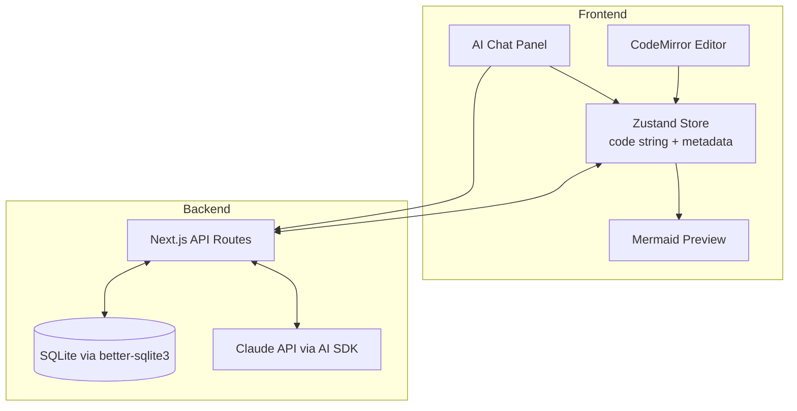
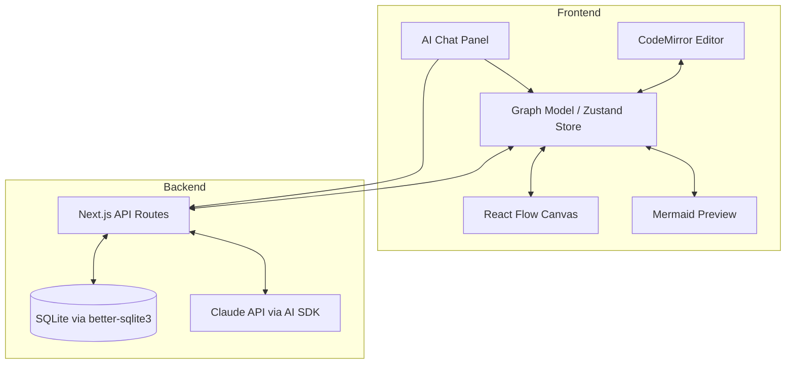

# VizMerm: Mermaid Vibe-Coding Diagram Editor

## Enhancement Summary

**Deepened on:** 2026-03-10
**Review agents used:** TypeScript Reviewer, Performance Oracle, Security Sentinel, Architecture Strategist, Frontend Races Reviewer, Agent-Native Reviewer, Code Simplicity Reviewer, Pattern Recognition Specialist

### Key Improvements
1. **Simplified MVP**: Removed React Flow from Phase 1 — mermaid code string is the source of truth, no graph model abstraction needed initially. AI + code editor IS the vibe-coding experience.
2. **Security hardened**: Mermaid `securityLevel: 'strict'`, SVG sanitization via DOMPurify, AI output validation before DOM injection.
3. **Race condition protection**: Generation counter pattern for stale parses, state machine for sync coordination (`IDLE | AI_STREAMING | USER_DRAGGING`), canvas locks during AI streaming.
4. **Agent-native parity**: Expanded AI tools to cover edges, metadata, positions, and export — not just node operations.
5. **Simplified storage**: `better-sqlite3` with raw SQL instead of Prisma ORM for a single-table app.

### Architecture Revision (Based on Simplicity Review)

The original plan had React Flow + CodeMirror + Mermaid Preview (three views of the same data). **Revised approach**: Phase 1 ships with CodeMirror + Mermaid Preview only (two views). React Flow canvas is Phase 2 — added only after the core vibe-coding experience (AI + code) works. This eliminates the graph model abstraction, bidirectional sync, and custom parser from the MVP.

---

## Overview

A web app for creating and editing mermaid diagrams through a hybrid code + visual interface. Users can write mermaid syntax directly, drag nodes around on a visual canvas, and use an AI agent to generate/modify diagrams via natural language. All diagrams are persistently stored and editable as code, enabling "vibe coding" on top of structured diagram data.

## Problem Statement / Motivation

Creating mermaid diagrams today is tedious: you write code blindly, preview, adjust, repeat. Visual diagram tools lose the code-as-source-of-truth benefit. There's no tool that combines:
- A live code editor with instant visual feedback
- Drag-and-drop visual editing that writes back to code
- AI-assisted generation so you can describe what you want in natural language
- Persistent storage so your diagrams are always saved and accessible

## Proposed Solution

A Next.js 15 full-stack app with a phased approach:

**Phase 1 (MVP)**: Code editor + mermaid preview + AI chat + persistent storage
**Phase 2**: React Flow visual canvas with drag-and-drop + bidirectional sync
**Phase 3**: Polish, export, keyboard shortcuts

### Architecture (Phase 1 - MVP)



### Architecture (Phase 2 - Visual Canvas)



## Technical Approach

### Phase 1 Data Model: Mermaid Code as Source of Truth

For the MVP, **the mermaid code string IS the source of truth**. No graph model abstraction needed.

```typescript
// src/types/diagram.ts
interface DiagramState {
  id: string;
  title: string;
  code: string;        // mermaid source code - the one true source
  createdAt: string;
  updatedAt: string;
}

// Minimal Zustand store
interface DiagramStore {
  diagram: DiagramState | null;
  diagrams: DiagramState[];  // sidebar list
  isDirty: boolean;
  syncState: 'idle' | 'ai-streaming' | 'saving';
  setCode: (code: string) => void;
  setTitle: (title: string) => void;
  loadDiagram: (id: string) => Promise<void>;
  saveDiagram: () => Promise<void>;
  createDiagram: () => Promise<string>;
  deleteDiagram: (id: string) => Promise<void>;
}
```

### Phase 2 Data Model: Graph Model for Bidirectional Sync

Only introduced when React Flow canvas is added:

```typescript
// src/types/graph.ts — Phase 2 only
import type { CSSProperties } from 'react';

// Constrained node styles (not Record<string, string>)
type NodeStyle = Pick<CSSProperties, 'backgroundColor' | 'borderColor' | 'borderWidth' | 'color' | 'fontSize'>;

// Discriminated union for diagram types — flowchart only initially
type DiagramGraph = FlowchartGraph; // extend later: | SequenceGraph | ClassGraph

interface FlowchartGraph {
  diagramType: 'flowchart';
  direction: 'TB' | 'LR' | 'BT' | 'RL';
  nodes: Array<{
    id: string;
    label: string;
    type: 'default' | 'decision' | 'stadium' | 'subroutine' | 'cylinder' | 'circle';
    position: { x: number; y: number }; // REQUIRED for React Flow (not optional)
    style?: NodeStyle;
  }>;
  edges: Array<{
    id: string;  // edges need IDs too for React Flow
    source: string;
    target: string;
    label?: string;
    type: 'arrow' | 'dotted' | 'thick';
  }>;
}
```

### Research Insights (Type Safety)

- **Node positions must be required**, not optional — React Flow renders unpositioned nodes at (0,0), stacking them. Use dagre/elkjs for auto-layout when positions aren't manually set.
- **Edge IDs are required** by React Flow — the original plan omitted them.
- **Use discriminated unions** for diagram types — a single interface cannot faithfully represent flowcharts, sequence diagrams, and ER diagrams (they have fundamentally different structures).
- **Date fields should use branded types** or at minimum ISO string validation, not bare `string`.

### Tech Stack

| Layer | Technology | Why |
|-------|-----------|-----|
| Framework | Next.js 15 (App Router) | Full-stack, API routes, SSR for shell, fast dev |
| Code Editor | CodeMirror 6 | Lightweight, extensible, mermaid mode available |
| Visual Canvas | React Flow (xyflow) | **Phase 2** — Native drag-drop, zoom/pan, edge routing |
| State | Zustand | Simple, performant, subscribe-with-selector |
| Preview | Mermaid.js 11 | Accurate mermaid rendering for preview/export |
| Database | better-sqlite3 | Direct SQL, no ORM overhead for 1-2 tables |
| AI | Vercel AI SDK + Claude | Streaming, tool use, conversation context |
| Styling | Tailwind CSS 4 + shadcn/ui | Rapid UI development, consistent design |
| Sanitization | DOMPurify | SVG sanitization before DOM injection |
| Package Manager | pnpm | Fast, disk-efficient |

### Research Insights (Storage)

Prisma was replaced with `better-sqlite3` + raw SQL. For a single-table app storing `{ id, title, code, createdAt, updatedAt }`, Prisma adds unnecessary complexity (schema files, migrations, generated client, binary engine dependency). Two SQL statements (list + upsert) suffice.

```typescript
// src/lib/db.ts
import Database from 'better-sqlite3';
import path from 'path';

const db = new Database(path.join(process.cwd(), 'data', 'vizmerm.db'));
db.pragma('journal_mode = WAL');  // safe for concurrent reads

db.exec(`
  CREATE TABLE IF NOT EXISTS diagrams (
    id TEXT PRIMARY KEY,
    title TEXT NOT NULL DEFAULT 'Untitled Diagram',
    code TEXT NOT NULL DEFAULT 'flowchart TB\n    A[Start] --> B[End]',
    positions TEXT,
    created_at TEXT NOT NULL DEFAULT (datetime('now')),
    updated_at TEXT NOT NULL DEFAULT (datetime('now'))
  )
`);

export default db;
```

### Database Schema

```sql
CREATE TABLE diagrams (
  id TEXT PRIMARY KEY,
  title TEXT NOT NULL DEFAULT 'Untitled Diagram',
  code TEXT NOT NULL DEFAULT 'flowchart TB
    A[Start] --> B[End]',
  positions TEXT,  -- JSON: { nodeId: { x, y } } — Phase 2 only
  created_at TEXT NOT NULL DEFAULT (datetime('now')),
  updated_at TEXT NOT NULL DEFAULT (datetime('now'))
);
```

Chat messages are stored **in memory only** for MVP. The value is in the resulting diagram code, not in re-reading old chat transcripts. Persistent chat history can be added later if needed.

---

## Security Considerations

### Research Insights (Security Sentinel — CRITICAL)

**1. Mermaid XSS via `click` directive (CRITICAL)**
Mermaid supports `click nodeId href "javascript:alert('XSS')"` which executes JavaScript when `securityLevel` is `'loose'`. A user pasting mermaid code from the internet or AI generating malicious code could trigger XSS.

```typescript
// MANDATORY: in mermaid initialization
mermaid.initialize({
  securityLevel: 'strict',  // disables click callbacks and JS URIs
  startOnLoad: false,
  theme: 'default',
  flowchart: {
    htmlLabels: true,
    useMaxWidth: false,  // required for predictable sizing
  },
});
```

**2. SVG Injection via DOM (HIGH)**
Even with `securityLevel: 'strict'`, injecting SVG via `dangerouslySetInnerHTML` can contain `<script>`, `onload` handlers, or `<foreignObject>` with HTML. Always sanitize:

```typescript
// src/components/editor/mermaid-preview.tsx
import DOMPurify from 'dompurify';

const sanitizedSvg = DOMPurify.sanitize(svgString, {
  USE_PROFILES: { svg: true, svgFilters: true },
  ADD_TAGS: ['foreignObject'],  // if needed for mermaid labels
  FORBID_ATTR: ['onclick', 'onload', 'onerror', 'onmouseover'],
});
```

**3. AI Output Validation (HIGH)**
Before applying AI-generated mermaid code to the editor:

```typescript
async function validateAndApplyAIOutput(code: string): Promise<boolean> {
  try {
    await mermaid.parse(code);  // syntax validation
    // Check for dangerous patterns
    if (/click\s+\w+\s+href\s+"javascript:/i.test(code)) {
      return false;  // reject JS URIs
    }
    return true;
  } catch {
    return false;  // invalid syntax
  }
}
```

**4. API Input Validation**
All API routes must validate input. Use Zod schemas:

```typescript
import { z } from 'zod';

const updateDiagramSchema = z.object({
  title: z.string().min(1).max(200).optional(),
  code: z.string().max(50000).optional(),  // reasonable size limit
});
```

---

## Race Condition Protection

### Research Insights (Frontend Races Reviewer)

**1. Stale Parse Results (Generation Counter)**

When the user types fast, multiple parse cycles overlap. Use a generation counter to discard stale results:

```typescript
let currentGeneration = 0;

function onDebouncedCodeChange(code: string) {
  const myGeneration = ++currentGeneration;
  // Parse (sync or async)
  const isValid = validateMermaid(code);
  // Discard if a newer edit arrived
  if (myGeneration !== currentGeneration) return;
  if (isValid) updatePreview(code);
}
```

**2. AI Streaming vs User Editing (State Machine)**

When AI is streaming, the canvas (Phase 2) must be read-only. Use a sync state machine:

```typescript
type SyncState = 'idle' | 'ai-streaming' | 'user-dragging' | 'saving';

// Transitions:
// idle -> ai-streaming: lock canvas edits, disable canvas->code sync
// idle -> user-dragging: reject incoming AI edits (queue them)
// ai-streaming -> idle: apply final state, unlock canvas
// user-dragging -> idle: flush canvas->code sync
// NEVER: ai-streaming + user-dragging simultaneously
```

**3. Auto-Save During Edits**
Auto-save should snapshot the current state, not interfere with editing. Use `structuredClone` to capture state atomically before the async save.

---

## Implementation Phases

### Phase 1: Code Editor + AI Chat (MVP)

**Goal**: Working code editor with live mermaid preview, AI chat for diagram generation, and persistent storage. This IS the vibe-coding experience.

**Files to create:**

- `package.json` - Dependencies and scripts
- `next.config.ts` - Next.js configuration (mermaid needs dynamic import with `ssr: false`)
- `tailwind.config.ts` - Tailwind configuration
- `src/types/diagram.ts` - Shared TypeScript types
- `src/app/layout.tsx` - Root layout with providers
- `src/app/page.tsx` - Main app page (redirects to editor)
- `src/app/editor/[id]/page.tsx` - Editor page for a specific diagram
- `src/app/api/diagrams/route.ts` - GET (list), POST (create)
- `src/app/api/diagrams/[id]/route.ts` - GET, PUT, DELETE
- `src/app/api/ai/chat/route.ts` - Streaming AI chat endpoint
- `src/lib/db.ts` - better-sqlite3 database setup and queries
- `src/stores/diagram-store.ts` - Zustand store (code string + metadata)
- `src/components/editor/code-editor.tsx` - CodeMirror 6 mermaid editor
- `src/components/editor/mermaid-preview.tsx` - Live mermaid SVG preview (with DOMPurify)
- `src/components/editor/editor-layout.tsx` - Split pane layout (code | preview)
- `src/components/ai/chat-panel.tsx` - Chat UI panel
- `src/components/ai/chat-message.tsx` - Message bubble component
- `src/components/layout/sidebar.tsx` - Diagram list sidebar
- `src/components/layout/header.tsx` - Top bar with title, actions
- `src/lib/ai/system-prompt.ts` - Context-aware system prompt builder
- `src/lib/ai/tools.ts` - AI tool definitions (Zod schemas + Vercel AI SDK)

**AI Tool (MVP — one tool is enough):**

```typescript
import { z } from 'zod';
import { tool } from 'ai';

export const updateDiagram = tool({
  description: 'Replace the current mermaid diagram code with new valid mermaid syntax',
  parameters: z.object({
    code: z.string().min(1).describe('Valid mermaid diagram syntax'),
  }),
  execute: async ({ code }) => {
    // Validation happens before applying
    return { code };
  },
});
```

The AI sees the current mermaid code in its system prompt and can explain/suggest without tools — it just responds with text. Only `updateDiagram` needs to be a tool call.

**Acceptance Criteria:**
- [ ] User can create a new diagram (auto-redirect on first visit)
- [ ] CodeMirror editor with mermaid syntax highlighting
- [ ] Live mermaid preview updates on code change (debounced ~300ms)
- [ ] Mermaid rendered with `securityLevel: 'strict'` + DOMPurify sanitization
- [ ] Diagrams auto-save to SQLite on change (debounced ~1s)
- [ ] Sidebar lists all diagrams with create/delete/rename
- [ ] Invalid syntax shows error indicator without crashing preview
- [ ] AI chat panel for natural language diagram creation/modification
- [ ] AI generates valid mermaid code via `updateDiagram` tool
- [ ] AI output validated with `mermaid.parse()` before applying
- [ ] Streaming responses with typing indicator
- [ ] AI has context of current diagram code in system prompt

### Phase 2: Visual Canvas & Bidirectional Sync

**Goal**: React Flow canvas with drag-and-drop that syncs back to code. Only start after Phase 1 is solid.

**Files to create/modify:**

- `src/types/graph.ts` - Graph model types (FlowchartGraph discriminated union)
- `src/components/editor/visual-canvas.tsx` - React Flow canvas component
- `src/components/editor/custom-nodes.tsx` - Custom React Flow node types matching mermaid shapes
- `src/components/editor/editor-layout.tsx` (modify) - Add canvas as third pane
- `src/lib/parser/mermaid-to-graph.ts` - Parse mermaid code to graph model
- `src/lib/parser/graph-to-mermaid.ts` - Serialize graph model to mermaid code
- `src/lib/parser/graph-to-reactflow.ts` - Convert graph model to React Flow format
- `src/lib/parser/reactflow-to-graph.ts` - Convert React Flow state to graph model
- `src/stores/diagram-store.ts` (modify) - Expand store with graph model and sync state machine

**Research Insights (Naming Consistency):**
Parser files renamed to reflect actual data flow through the graph model intermediary:
- `mermaid-to-graph.ts` (not `mermaid-parser.ts`)
- `graph-to-mermaid.ts` (not `flow-to-mermaid.ts`)
- `graph-to-reactflow.ts` (not `mermaid-to-flow.ts`)
- `reactflow-to-graph.ts` (new)

**Research Insights (Bidirectional Sync — Architecture + Races):**

1. **Narrow to flowcharts only initially.** Sequence diagrams are ordered message sequences, not graphs. Class diagrams have attributes on nodes. The graph model cannot faithfully represent all 6 diagram types — start with flowcharts, add others as discriminated union variants later.

2. **Round-trip fidelity warning**: Mermaid syntax supports `subgraph`, `classDef`, `%%` comments, and `style` directives that have no representation in the graph model. These will be silently dropped during code->graph->code round-trips. Preserve unparseable sections as opaque blocks.

3. **Sync state machine is mandatory** (see Race Condition Protection section). Never allow AI streaming and user dragging simultaneously.

4. **Undo/redo**: Use `zustand-temporal` or custom middleware that batches rapid sequential mutations from the same source before pushing to history (a drag operation produces dozens of intermediate positions — collapse into one undo step).

**Research Insights (Performance):**

Split Zustand into separate slices to prevent cross-contamination:
```typescript
const useCodeStore = create<CodeSlice>(...);   // CodeMirror subscribes here
const useGraphStore = create<GraphSlice>(...); // React Flow subscribes here
// Sync coordinator lives outside React, bridges the two
```

This prevents a code edit from triggering React Flow re-renders before the parse even completes.

**Acceptance Criteria:**
- [ ] React Flow canvas renders flowchart nodes and edges from mermaid code
- [ ] Nodes are draggable; positions persist in SQLite `positions` column
- [ ] Dragging a node updates the mermaid code
- [ ] Code edits update the canvas in real-time
- [ ] Custom node shapes match mermaid node types (rectangle, diamond, stadium)
- [ ] Edge routing updates when nodes are moved
- [ ] Zoom, pan, minimap controls work
- [ ] Split pane is resizable between code editor and canvas
- [ ] Canvas is read-only during AI streaming (with visual indicator)
- [ ] Generation counter prevents stale parse results from flashing
- [ ] Only flowchart diagram type supported in visual canvas

### Phase 3: Polish & Export

**Goal**: Production-quality UX with keyboard shortcuts, export, and expanded AI tools.

**Files to create/modify:**

- `src/components/editor/toolbar.tsx` - Export, undo/redo, layout, view toggle buttons
- `src/lib/export.ts` - PNG, SVG, and code export utilities
- `src/hooks/use-keyboard-shortcuts.ts` - Keyboard shortcut handler
- `src/lib/ai/tools.ts` (modify) - Expanded AI tools for full agent-native parity
- `src/app/editor/[id]/page.tsx` (modify) - Add undo/redo, keyboard shortcuts

**Research Insights (Agent-Native Parity — Expanded Tools):**

For Phase 3, expand AI tools to achieve full parity with user actions:

```typescript
import { z } from 'zod';
import { tool } from 'ai';

// Phase 1 tool (already exists)
export const updateDiagram = tool({ /* ... */ });

// Phase 3 additions
export const modifyGraph = tool({
  description: 'Add, remove, or modify nodes and edges',
  parameters: z.object({
    operations: z.array(z.discriminatedUnion('type', [
      z.object({ type: z.literal('addNode'), id: z.string(), label: z.string() }),
      z.object({ type: z.literal('removeNode'), nodeId: z.string() }),
      z.object({ type: z.literal('addEdge'), source: z.string(), target: z.string(), label: z.string().optional() }),
      z.object({ type: z.literal('removeEdge'), source: z.string(), target: z.string() }),
    ])),
  }),
});

export const updateMetadata = tool({
  description: 'Update diagram title or direction',
  parameters: z.object({
    title: z.string().optional(),
    direction: z.enum(['TB', 'LR', 'BT', 'RL']).optional(),
  }),
});

export const exportDiagram = tool({
  description: 'Export the diagram in the specified format',
  parameters: z.object({
    format: z.enum(['png', 'svg', 'mermaid']),
  }),
});
```

**Acceptance Criteria:**
- [ ] Export to PNG, SVG, and raw mermaid code
- [ ] Cmd+S to force save, Cmd+Z/Cmd+Shift+Z for undo/redo
- [ ] Dark mode support via Tailwind
- [ ] Loading states and skeleton UI
- [ ] Error boundaries prevent full-page crashes
- [ ] AI can modify edges, metadata, and trigger export (agent-native parity)

## Alternative Approaches Considered

### 1. Mermaid.js as the only rendering engine (with SVG manipulation for drag)
**Rejected**: Fighting mermaid's one-way rendering pipeline is brittle. SVG post-processing for drag works but edge re-routing is extremely hard. React Flow gives us drag-and-drop for free (Phase 2).

### 2. Excalidraw or tldraw as the visual layer
**Rejected**: These are general-purpose drawing tools. React Flow is specifically built for node-graph UIs, which maps directly to mermaid's data model.

### 3. Server-side rendering with a traditional backend (Rails, Django)
**Rejected**: The editor is inherently a rich client-side app. Next.js gives us the best of both worlds (API routes + React SPA).

### 4. Prisma ORM for SQLite
**Rejected after review**: Prisma adds schema files, migrations, generated client, and a binary engine dependency. For 1-2 tables with simple CRUD, `better-sqlite3` with raw SQL is simpler and faster.

### 5. React Flow in Phase 1 (MVP)
**Rejected after simplicity review**: The vibe-coding value proposition is AI + code editor. React Flow adds massive complexity (graph model, bidirectional sync, custom parser, conflict resolution) that can be deferred. Phase 1 ships with CodeMirror + mermaid preview, which is already a complete product.

### 6. Multiple AI tools in Phase 1
**Rejected after simplicity review**: `updateDiagram` (full code replacement) is sufficient. The AI can explain and suggest via plain text responses — no tool call needed. Granular `modifyNodes` requires the graph model abstraction that doesn't exist in Phase 1.

## Success Metrics

- User can go from empty state to a complete diagram in under 60 seconds using AI
- Mermaid preview latency < 300ms from keystroke (debounce + render)
- Auto-save never loses more than 1 second of work
- AI successfully generates valid mermaid code > 95% of the time
- Phase 2: Bidirectional sync latency < 100ms (code change -> canvas update)

## Dependencies & Prerequisites

- Node.js 20+
- pnpm
- Anthropic API key (for Claude via Vercel AI SDK)
- `ANTHROPIC_API_KEY` env var (never exposed to client-side code)

## Risk Analysis & Mitigation

| Risk | Impact | Mitigation |
|------|--------|------------|
| Mermaid XSS via click directive | Script execution in app context | `securityLevel: 'strict'` + DOMPurify sanitization |
| AI generating invalid mermaid | Chat produces broken diagrams | Validate with `mermaid.parse()` before applying; retry on failure |
| SVG injection via DOM | XSS through crafted SVG content | DOMPurify with SVG profile, forbid event handler attributes |
| AI prompt injection | Malicious output generation | Validate AI output; never trust raw output for DOM injection |
| Mermaid parser instability (Phase 2) | Code-to-graph conversion breaks | Write custom parser for flowcharts only; use mermaid only for rendering |
| React Flow performance (Phase 2) | Lag with 100+ nodes | Virtualization built into React Flow; split Zustand stores |
| Bidirectional sync conflicts (Phase 2) | Code and canvas fight each other | Sync state machine; generation counter; canvas lock during AI streaming |
| Mermaid.js ESM + Next.js SSR | Import errors on server | Dynamic import with `{ ssr: false }` or `next/dynamic` |

## SpecFlow Analysis - Key Gaps Identified

### First Visit Experience
- App should show a welcome state with a starter diagram (not blank)
- Default template: `flowchart TB\n    A[Start] --> B[End]`
- Auto-redirect to `/editor/[newId]` on first visit

### Node Resizing
- Mermaid syntax does not support node sizing — **out of scope**
- React Flow nodes (Phase 2) will auto-size based on label content

### Connection Creation on Canvas (Phase 2)
- React Flow supports connection handles natively
- New connections create edges in the graph model -> serialize to mermaid `A --> B`
- Must validate connections (no self-loops, no duplicate edges)

### Conflict Resolution (Phase 2 — Bidirectional Sync)
- Sync state machine: `idle | ai-streaming | user-dragging | saving`
- Generation counter discards stale parse results
- AI changes are atomic: apply full replacement, not incremental
- Canvas locked during AI streaming with visual indicator

### Multi-Tab Safety (Deferred)
- Not needed for MVP. Single-user local app.
- Can be added later with `BroadcastChannel` if user reports warrant it.

### Undo/Redo (Phase 2+)
- Phase 1: CodeMirror has built-in undo/redo for code changes
- Phase 2: Graph-level undo stack with batch collapsing for drag operations

### Round-Trip Fidelity (Phase 2)
- Mermaid features not representable in graph model (`subgraph`, `classDef`, `%%` comments, `style` directives) will be preserved as opaque blocks during round-trips
- Warn users when switching to visual edit mode if code contains unsupported features

## File Organization

```
src/
  types/
    diagram.ts           # Shared types (DiagramState, DiagramStore)
    graph.ts             # Phase 2: Graph model types (FlowchartGraph)
  app/
    layout.tsx
    page.tsx
    editor/[id]/page.tsx
    api/
      diagrams/route.ts
      diagrams/[id]/route.ts
      ai/chat/route.ts
  lib/
    db.ts                # better-sqlite3 setup + queries
    ai/
      system-prompt.ts
      tools.ts
    parser/              # Phase 2 only
      mermaid-to-graph.ts
      graph-to-mermaid.ts
      graph-to-reactflow.ts
      reactflow-to-graph.ts
    export.ts            # Phase 3
  stores/
    diagram-store.ts
  hooks/
    use-keyboard-shortcuts.ts  # Phase 3
  components/
    editor/
      code-editor.tsx
      mermaid-preview.tsx
      editor-layout.tsx
      visual-canvas.tsx   # Phase 2
      custom-nodes.tsx    # Phase 2
      toolbar.tsx         # Phase 3
    ai/
      chat-panel.tsx
      chat-message.tsx
    layout/
      sidebar.tsx
      header.tsx
```

## References & Research

### Key Libraries
- [React Flow / xyflow](https://reactflow.dev/) - Interactive node graph UI (Phase 2)
- [Mermaid.js](https://mermaid.js.org/) - Diagram rendering from code
- [CodeMirror 6](https://codemirror.net/) - Code editor framework
- [Vercel AI SDK](https://sdk.vercel.ai/) - AI integration with streaming
- [better-sqlite3](https://github.com/WiseLibs/better-sqlite3) - SQLite for Node.js
- [shadcn/ui](https://ui.shadcn.com/) - UI component library
- [Zustand](https://zustand-demo.pmnd.rs/) - State management
- [DOMPurify](https://github.com/cure53/DOMPurify) - SVG/HTML sanitization

### Architecture Inspiration
- Mermaid Live Editor (official) - Code-only, no drag-and-drop
- Eraser.io - AI diagram tool (commercial)
- draw.io / diagrams.net - Visual diagram editor with code export
